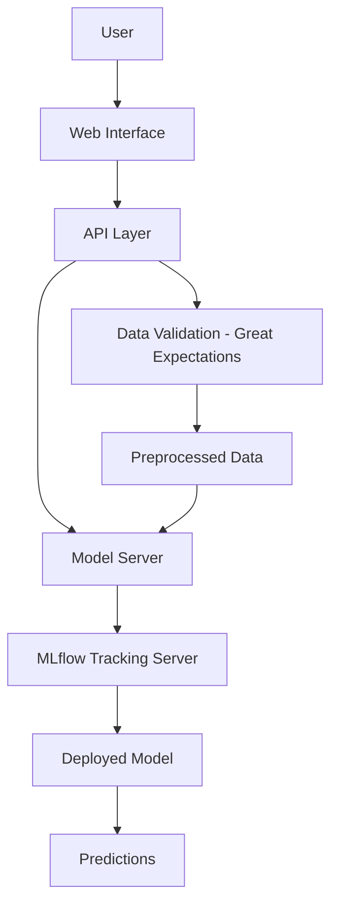

# End-to-End Customer Churn Prediction 

This repository provides an end-to-end solution for customer churn prediction using machine learning. It integrates tools like MLFlow for model tracking, Great Expectations for data validation, Docker for containerization, and GitHub Actions for CI/CD workflows. The project demonstrates a full lifecycle of a machine learning application, from data preprocessing and model training to deployment and monitoring.

## Overview

The End-to-End Customer Churn ML project is designed to predict customer churn using machine learning techniques. The primary goal is to provide a robust and scalable pipeline that handles data validation, model training, and deployment. The project leverages modern tools like MLFlow for experiment tracking, Great Expectations for ensuring data quality, and Docker for containerized deployments. Additionally, GitHub Actions is used for automating workflows, making the system reliable and efficient for production-level deployment. This repository serves as a template for similar machine learning projects that aim to integrate best practices and streamline operations.

## Architecture Diagram

## Key Features

1. **MLFlow Integration**: Tracks experiments, manages model versions, and enables reproducibility.
2. **Great Expectations**: Ensures data quality through automated validation and profiling.
3. **Dockerized Deployment**: Facilitates containerized and portable deployment across environments.
4. **GitHub Actions**: Automates testing, building, and deployment workflows.
5. **End-to-End Pipeline**: Covers data preprocessing, model training, evaluation, and deployment.
6. **Web Interface Demo**: Provides a live demo for end-users to interact with the deployed model.

## Technology Stack

1. **Programming Language**: Python
2. **Model Tracking**: MLFlow
3. **Data Validation**: Great Expectations
4. **Containerization**: Docker
5. **CI/CD**: GitHub Actions
6. **Deployment Platform**: Railway App
7. **Frameworks and Libraries**: pandas, scikit-learn, Streamlit

## Getting Started

1. Clone the repository: `git clone https://github.com/sarav18302/End-to-End-Customer-Churn-ML.git`.
2. Build the Docker image: `docker build -t churnapp .`.
3. Run the container: `docker run -p 5000:5000 churnapp`.
4. Access the web interface via [Website Link](https://churnapp-production-c088.up.railway.app/ui/).
5. For model training and tracking, install and configure MLFlow.
6. Use Great Expectations to validate your data before feeding it into the pipeline.
7. Refer to the [Docker Hub Link](https://hub.docker.com/r/sarav1832/churnapp) for pre-built Docker images.
8. Set up GitHub Actions workflows for CI/CD by following the `.github/workflows` directory in the repository.

---
*Generated on December 22, 2025 at 3:10 PM*
